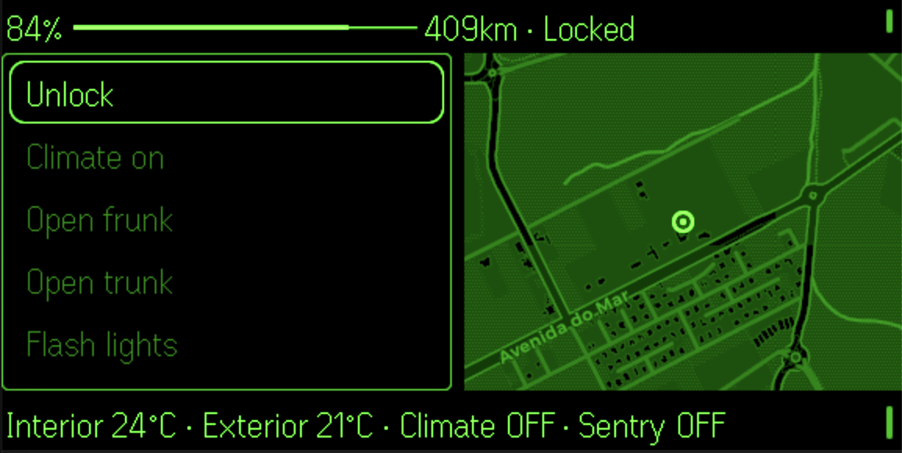

# Tesla Even G2

> See also: [G2 development notes](https://github.com/nickustinov/even-g2-notes/blob/main/G2.md) – hardware specs, UI system, input handling and practical patterns for Even Realities G2.

Tesla vehicle controls for [Even Realities G2](https://www.evenrealities.com/) smart glasses.

35+ commands across climate, charging, security, windows and more – all from your glasses. View battery, range, temperatures, charging and sentry status at a glance with a live map showing your car's location.



## System architecture

```
[G2 glasses] <--BLE--> [Even app / simulator] <--HTTP--> [Proxy server] <--HTTPS--> [Tessie API]
                                                                    \--- [CartoDB tiles]
```

The proxy server keeps the Tessie API token server-side, forwards commands with query parameters for parameterized operations (temperature, charge limit, etc.), and renders static map images from CartoDB dark tiles.

## App architecture

```
g2/
  index.ts         App module registration
  main.ts          Bridge connection + settings UI bootstrap
  app.ts           Thin orchestrator: initApp, refreshState
  state.ts         VehicleState type, app state singleton, bridge holder
  api.ts           HTTP client: getState, sendCommand (with params), getMap
  actions.ts       Action type system, all 6 categories with 35+ commands
  navigation.ts    Stack-based menu navigation controller
  events.ts        Event normalisation + screen-specific dispatch
  renderer.ts      All screen rendering (dashboard, menu, loading, confirmation)
  layout.ts        Display dimension constants
  ui.tsx           React settings panel (token, server URL, connection status)

server/src/
  index.ts         Hono proxy: Tessie API, query param forwarding, map rendering
```

### Data flow

`app.ts` is the entry point that wires everything together. On startup it fetches vehicle state via `api.ts`, stores it in the `state.ts` singleton, and tells `renderer.ts` to paint the dashboard. User interactions flow through `events.ts`, which normalises raw SDK events and dispatches them based on the current screen. Menu navigation uses a stack in `navigation.ts` – pushing levels for categories, action lists and preset sub-menus, popping on back.

### Action model

Commands are defined declaratively in `actions.ts` using four action types:

- **Toggle** – context-aware label and command based on vehicle state (e.g. Lock/Unlock)
- **Command** – simple one-shot command, optionally with query parameters
- **Sub-menu** – drills into a list of child actions (e.g. temperature presets)
- **Refresh** – triggers a state refresh

Actions are grouped into 6 categories: Quick actions (shown on dashboard), Climate, Charging, Security, Windows and Other. The `resolveLabel` and `resolveCommand` helpers turn any action into a concrete label and command based on current vehicle state.

### Navigation model

The dashboard shows quick actions plus a "More >" entry. Selecting it pushes a category list onto the navigation stack. Selecting a category pushes its action list. Parameterized commands (temperature, charge limit, seat heating, etc.) push a preset sub-menu. Max depth is 3 levels.

```
Dashboard (quick actions + "More >")
  -> Categories (Climate, Charging, Security, Windows, Other)
     -> Action list
        -> Preset sub-menu (for parameterized commands)
```

Every non-dashboard screen has "< Back" at index 0. Double-tap always goes back one level.

## Setup

### 1. Server

```bash
cd server
npm install
npm run dev
```

The server listens on `http://localhost:3001`. It accepts the Tessie API token from the browser settings panel via the `X-Tessie-Token` header.

Get a Tessie token at [tessie.com](https://www.tessie.com/) under Settings.

### 2. G2 app

```bash
npm install
npm run dev
```

Opens on `http://localhost:5173`. Enter your Tessie token and server URL in the settings panel, then click **Connect Tesla**.

### 3. Running on glasses

In a second terminal, generate a QR code and scan it with the Even App:

```bash
npx evenhub qr --http --ip <your-local-ip> --port 5173
```

### 4. G2 simulator

Requires [even-dev](https://github.com/BxNxM/even-dev) (Unified Even Hub Simulator v0.0.2).

```bash
# Copy into even-dev (adjust paths to your local setup)
cp -r "$(pwd)/g2" /path/to/even-dev/apps/tesla

# Run
cd /path/to/even-dev
APP_NAME=tesla ./start-even.sh
```

Enter your Tessie token in the browser settings panel, then click **Connect Tesla** to load the dashboard on the glasses display.

## Glasses UI

The dashboard shows battery level, range, lock state and charging status in the header, a scrollable quick-actions list on the left, a live map on the right, and temperature/climate/sentry info in the footer. Menu screens use the full display width.

### Commands

**Quick actions** (dashboard) – Lock/Unlock, Climate on/off, Open frunk, Open trunk, Flash lights, Honk, Refresh

**Climate** – Climate on/off, Defrost on/off, Wheel heater on/off, Set temperature (18/20/22/24/26 C), Seat heating (per-seat, levels 0–3), Seat cooling (per-seat, levels 0–3)

**Charging** – Charge port open/close, Start/Stop charging, Charge limit (50–100%), Charging amps (8/16/24/32/48 A)

**Security** – Sentry on/off, Valet on/off, Guest on/off, Keyless driving

**Windows** – Vent/Close windows, Vent/Close sunroof

**Other** – HomeLink, Boombox, Bio defense on/off, Wake

### Navigation

| Input | Dashboard | Menu | Confirmation |
|---|---|---|---|
| Tap | Execute action / open More | Execute action / navigate | Back to dashboard |
| Double tap | Refresh state | Go back one level | Back to dashboard |

## Tech stack

- **Server:** [Hono](https://hono.dev/) + Node + [sharp](https://sharp.pixelplumbing.com/)
- **Map tiles:** [CartoDB dark matter](https://github.com/CartoDB/basemap-styles) (free, no API key)
- **G2 frontend:** TypeScript + [Even Hub SDK](https://www.npmjs.com/package/@evenrealities/even_hub_sdk)
- **Settings UI:** React + [@jappyjan/even-realities-ui](https://www.npmjs.com/package/@jappyjan/even-realities-ui)
- **Vehicle API:** [Tessie](https://developer.tessie.com)
